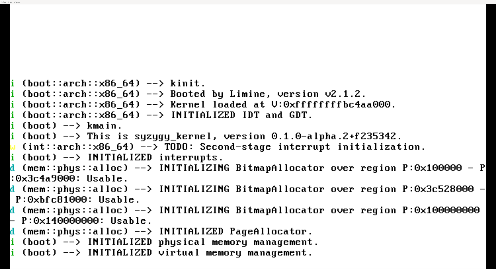

# syzygy

A kernel in Rust. Currently does very little other than boot and allocate
memory. This is the second iteration of the project. See the `old` branch for
the previous version, which currently is more featureful.

## Building
Dependencies:
* [Rustup](https://rustup.rs) or a recent Rust nightly toolchain with the `rust-src` component.
  * The `miri` component is optional to build, but required for the test suite.
* [GHC](https://www.haskell.org/ghc/).
* [Shake](https://shakebuild.com/).
* Make.
* A C compiler.

Before doing anything, ensure all submodules are present and up to date. If this
is the first build, run a `git submodule update --init --recursive`. When
subsequently pulling the repository, make sure to use `git pull
--recurse-submodules`.

The build system is written using [Shake](https://shakebuild.com/) and requires
a Haskell toolchain. The build script at `scripts/shake.sh` provides a
convenient interface to the build system, recompiling it if necessary. Any
arguments to the script are forwarded to the build system.

To build the kernel, run `./scripts/shake.sh`. To run it in QEMU, simply run
`./scripts/shake.sh run`.

Build options, including kernel features, build targets, and QEMU options can be
configured in `cfg/*.cfg`. `shake.cfg` is the currently-active configuration.

Inspirations include, in no particular order:
* [Redox](https://www.redox-os.org/)
* [Philipp Oppermann's Blog OS](https://os.phil-opp.com/)
* [SerenityOS](http://serenityos.org/)
* [The OSDev Wiki](https://wiki.osdev.org/Main_Page)
